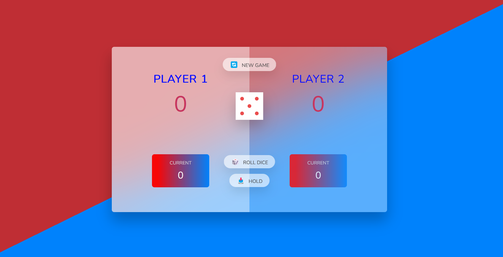

# Dice Game 🎲

## Overview

The "Dice Game" is a fun and interactive game built using HTML, CSS, and JavaScript. The game allows two players to roll dice and accumulate points, with the option to hold their current score or risk it all for a higher score.

## Features

- Two-player game
- Roll dice to accumulate points
- Option to hold your current score
- Switch between active players
- Reset game scores with a "New Game" button
- Visually appealing UI with smooth transitions

## Technologies Used

- HTML
- CSS
- JavaScript

## How to Play

1. Clone this repository

- git clone https://github.com/alexlux58/dice-game.git

2. Open `index.html` in your web browser.
3. Click the "Roll Dice" button to roll the dice and accumulate points.
4. Click the "Hold" button to save your current score.
5. Switch turns between Player 1 and Player 2.
6. The first player to reach a set target wins!

## Contributing

Feel free to fork this repository and make your own changes. Pull requests are welcome!

## License

This project is open-source and available under the MIT License.

## Author

- [Alex](https://github.com/alexlux58)
